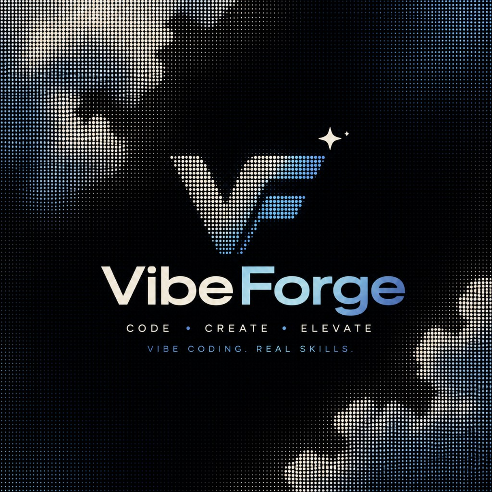

<div align="center">

  

  # VibeForge — Vibe Code Your Way to Production

  **Master vibe coding. Ship production-ready apps in record time.**

  [](https://nextjs.org/)
  [](https://react.dev/)
  [](https://www.typescriptlang.org/)
  [](https://tailwindcss.com/)
  [](https://motion.dev/)

</div>

---

## What is VibeForge?

**VibeForge** is a vibe-coding academy website — AI-assisted development, prompt engineering, and full-stack building taught by hackathon-winning mentors from India. Learn the exact stack used by top indie hackers and production teams, get 1:1 guidance, and launch your first product in 30 days.

- Live site structure: Home · Gallery · Mentors · Testimonials · Pricing
- Enroll via plans below, or ping us directly on [WhatsApp](https://wa.me/919073347571?text=Hi%2C%20I%20want%20to%20know%20more%20about%20the%20course)

---

## Highlights

| | |
|---|---|
| Scroll-driven cinematic hero | 169-frame canvas sequence synced to scroll, with quote cards and HUD overlays |
| Second cinematic act | Another 169-frame scroll sequence with beat cards and progress readouts |
| Buttery smooth scrolling | Lenis-powered smooth scroll, tuned for fast mouse + touch response |
| Hall of Achievements | Auto-scrolling marquee gallery of real student wins |
| Mentor profiles | Hackathon records, skills, LinkedIn / WhatsApp links |
| Student voices | Reviews from builders across Delhi, Bangalore, Mumbai, Pune, Hyderabad, Chennai |
| INR / USD pricing toggle | One click switches the whole pricing section between India and international pricing |
| Fully responsive | Mobile-first layouts, hamburger menu, adaptive canvas rendering |

---

## Plans

| Plan | Price | Best for |
|------|-------|----------|
| **Starter** | **₹599** / $7 · per month | 3 group courses (beginner → advanced), 24×7 support for 1 month, 22 secret UI/UX links, VibeCoding Secret Bible PDF |
| **Builder** ⭐ Most Popular | **₹1,499** / $29 | Everything in Starter, all 20+ courses, AI-assisted coding deep dives, full-stack templates, 5 group sessions, hackathon guidance till the grand finals |
| **Agency** | **₹4,999** / $79 · per month | Everything in Builder, 7 vibe-coding sessions, full hackathon guidance till the end, 24×7 personal support, 1-on-1 coaching, custom curriculum |

Every **Get Started** button routes to the enrollment form. **Contact** in the navbar opens WhatsApp with a pre-filled message.

---

## Tech Stack

- **Framework** — Next.js 16 (App Router, Turbopack)
- **UI** — React 19, TypeScript 5, Tailwind CSS 4
- **Motion** — Framer Motion 12, Lenis 1.3 smooth scroll
- **Icons** — Phosphor Icons
- **Fonts** — Geist Sans + Geist Mono

---

## Getting Started

### Prerequisites

- Node.js 20+
- npm

### Run locally

```bash
# 1. Clone the repo
git clone https://github.com/KRISHNA0R/VibeForge1.0.git
cd VibeForge1.0

# 2. Install dependencies
npm install

# 3. Start the dev server
npm run dev
```

Open [http://localhost:3000](http://localhost:3000) — edits hot-reload instantly.

### Other scripts

```bash
npm run build    # Production build
npm run start    # Serve the production build
npm run lint     # ESLint
```

---

## Project Structure

```
src/
├── app/
│   ├── page.tsx              # Home: Hero → Cinematic → Gallery → Tools → Mentors → Pricing → Reviews → CTA
│   ├── gallery/page.tsx      # Achievements gallery
│   ├── mentors/page.tsx      # Mentor profiles
│   ├── testimonials/page.tsx # Student reviews
│   ├── pricing/page.tsx      # Plans
│   ├── layout.tsx            # Fonts, metadata, smooth-scroll provider
│   └── globals.css           # Theme tokens, Lenis + scroll-animation styles
├── components/
│   ├── sections/             # Hero, CinematicReveal, Gallery, Tools, Mentors,
│   │                         # Pricing, Testimonials, CallToAction, Footer, ...
│   ├── ui/                   # Navbar, PlanCard, EyebrowBadge, HudFrame, ...
│   └── providers/            # SmoothScrollProvider (Lenis)
├── lib/
│   ├── hero.ts               # Hero frame dialogue data
│   └── cinematic.ts          # Cinematic beat data
public/
├── logo.jpg                  # VibeForge logo
├── frames/                   # Hero canvas sequence (169 frames)
├── frames2/                  # Cinematic canvas sequence (169 frames)
├── achievement-photos/       # Student win photos
└── tool-logos/               # Stack logos
```

---

## Mentors

| Mentor | Focus |
|--------|-------|
| **Krrish Kumar** — Software Engineer & AI/ML Researcher | Python, PyTorch, React, TypeScript, Cybersecurity · ZSI 111-Hour Hackathon Winner, IIT Hyderabad research intern |
| **Krishna R** — Founder & Lead Mentor | React, Next.js, Node.js, UI/UX, DevOps · 3× National Hackathon Finalist, IIT KGP & IIT Delhi Campus Ambassador |

---

## Configuration

| What | Where |
|------|-------|
| Enrollment form link | `src/components/ui/PlanCard.tsx` |
| WhatsApp number + pre-filled message | `src/components/ui/Navbar.tsx` (`navLinks`), `src/components/sections/Footer.tsx` |
| Plans, prices, features | `src/components/sections/Pricing.tsx` |
| Reviews | `src/components/sections/Testimonials.tsx` |
| Scroll feel (Lenis) | `src/components/providers/SmoothScrollProvider.tsx` |
| Pinned scroll length | `.scroll-animation` in `src/app/globals.css` |

---

## Deployment

The app is a standard Next.js build — deploy anywhere:

```bash
npm run build && npm run start
```

Works out of the box on **Vercel** (recommended), Netlify, or any Node host.

---

## Contact

- **WhatsApp** — [+91 90733 47571](https://wa.me/919073347571?text=Hi%2C%20I%20want%20to%20know%20more%20about%20the%20course)
- **Enrollment form** — shared via every *Get Started* button on the site

---

<div align="center">

  **Built for builders, by builders.**

  © VibeForge — Vibe Coding Academy · All rights reserved

</div>
